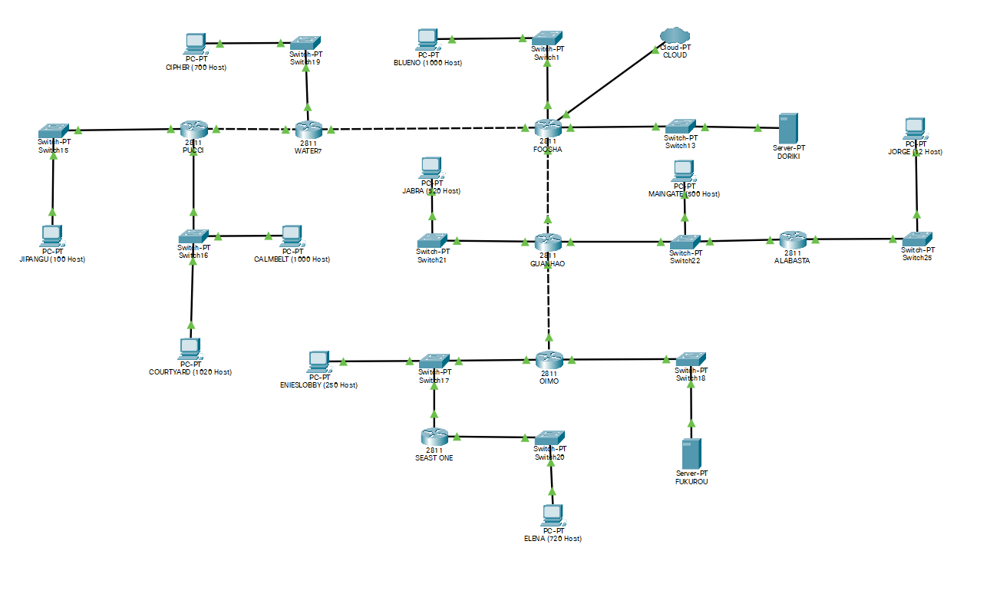
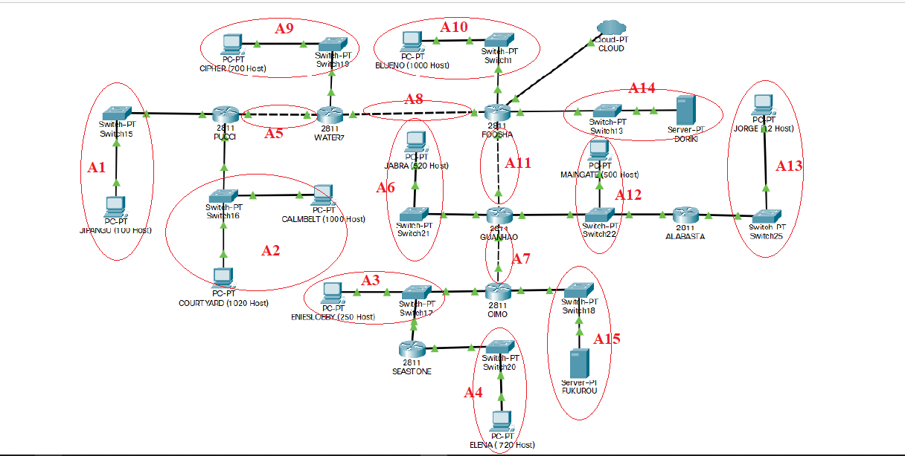
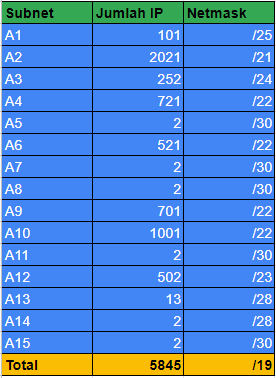
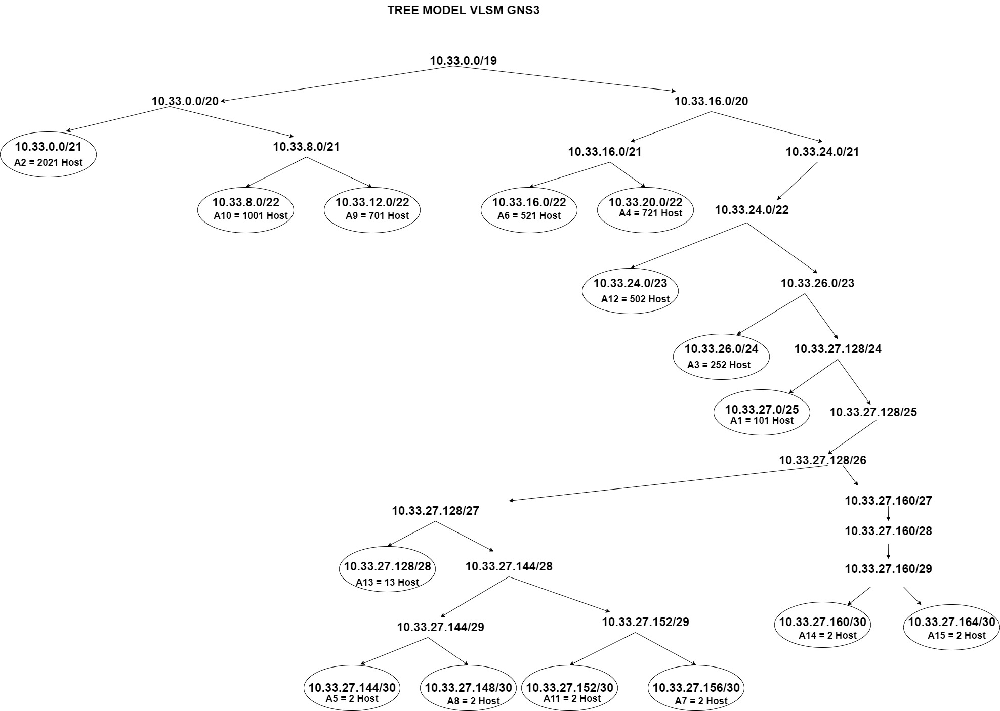
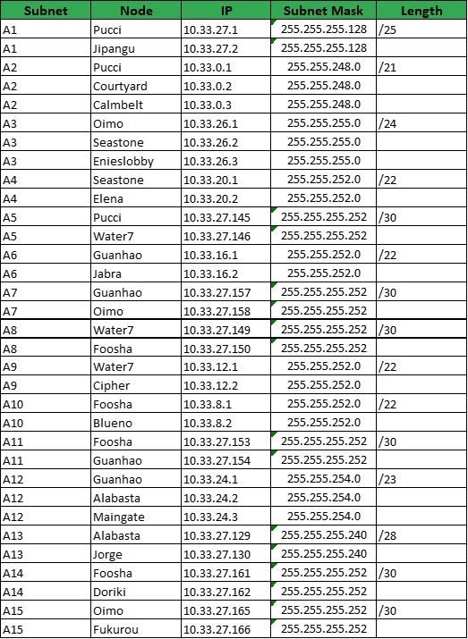
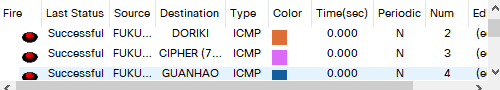
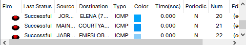
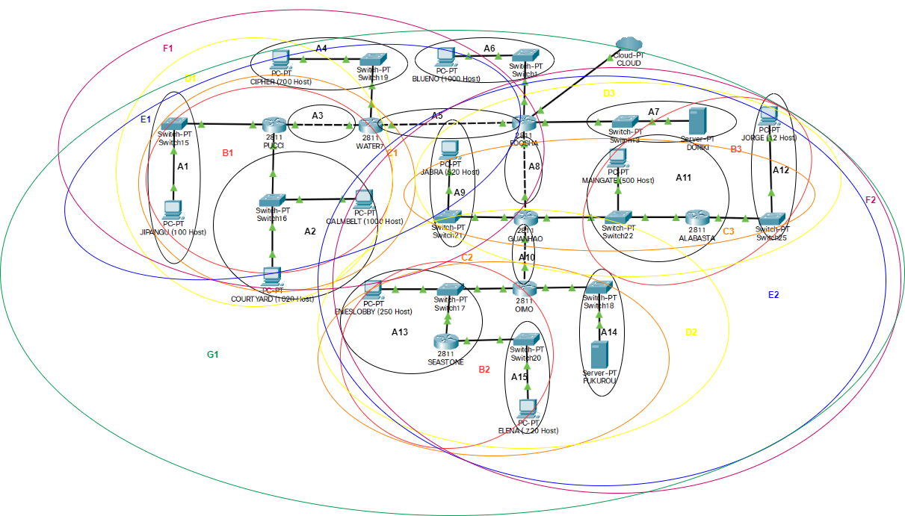
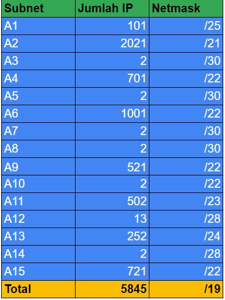
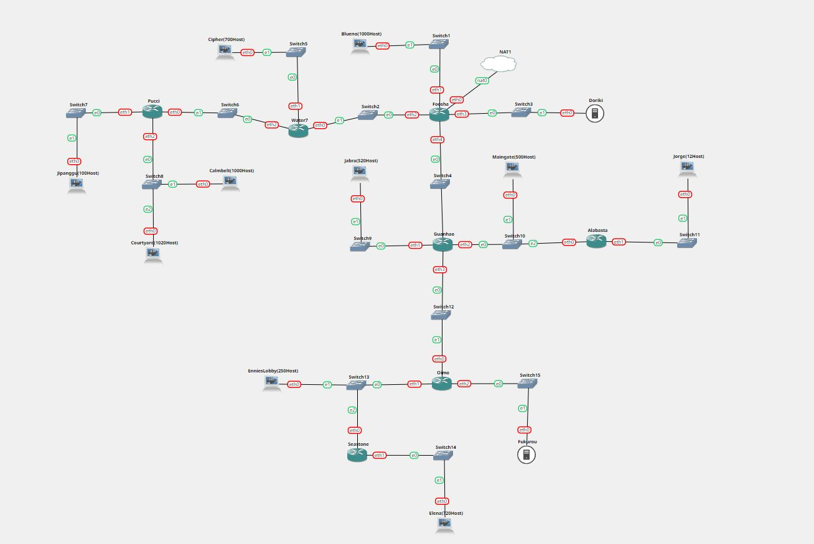

# Jarkom-Modul-4-E08-2021

**Lapres Praktikum Jaringan Komputer Modul 4**

- Fais Rafii Akbar Hidiya (05111940000026)
- Zahra Dyah Meilani (05111940000069)
- Aji Rindra Fakhrezi Putra Faisal (05111940000205)

## **1. VLSM dengan CPT**

Berikut topologi pada soal



### **a. Subnetting**

Berdasarkan topologi tersebut, didapatkan 15 pembagian subnet seperti yang terlihat pada gambar di bawah ini:



Detail dari setiap subnet ada pada tabel di bawah:



Dari tabel di atas diketahui bahwa subnet besar yang dibentuk mempunyai NID 10.33.0.0 dengan netmask /19. Pembagian IP berdasarkan NID dan netmask didapatkan dari hasil penghitungan menggunakan tree di bawah:



Dari tree tersebut didapatkan pembagian IP untuk setiap node menjadi seperti berikut:



Setelah itu ubah konfigurasi setiap node dengan IP serta netmask yang sesuai pada tabel dan topologi.

### **b. Routing**

Untuk melakukan routing, tambahkan static route ke semua router yang ada. Berikut merupakan route yang ditambahkan:

FOOSHA

```
10.33.12.0/22 via 10.33.27.149      #water7
10.33.24.0/23 via 10.33.27.154      #gunhao
10.33.27.0/25 via 10.33.27.149
10.33.16.0/22 via 10.33.27.154
10.33.27.128/28 via 10.33.27.154
10.33.27.160/28 via 10.33.27.162    #doriki
10.33.0.0/21 via 10.33.27.149
10.33.26.0/24 via 10.33.27.154
10.33.27.164/30 via 10.33.27.154
10.33.20.0/22 via 10.33.27.154
10.33.27.156/30 via 10.33.27.154
```

WATER7

```
0.0.0.0/0 via 10.33.27.150          #foosha
10.33.27.0/25 via 10.33.27.145      #pucci
10.33.0.0/21 via 10.33.27.145
```

PUCCI
```
0.0.0.0/0 via 10.33.27.146          #water7
```

GUANHAO

```
0.0.0.0/0 via 10.33.27.153          #foosha
10.33.27.128/28 via 10.33.24.2      #alabasta
10.33.26.0/24 via 10.33.27.158      #oimo
10.33.27.164/30 via 10.33.27.158
10.33.20.0/22 via 10.33.27.158
```

ALABASTA

```
0.0.0.0/0 via 10.33.24.1            #guanhao
```

OIMO

```
0.0.0.0/0 via 10.33.27.157          #guanhao
10.33.20.0/22 via 10.33.26.2        #seastone
```

SEASTONE

```
0.0.0.0/0 via 10.33.26.1        #oimo
```

### **c. Testing**

Untuk melakukan testing, kita bisa mencoba melakukan ping antar node, berikut merupakan contoh ping dengan source dan destination node yang sudah dicoba:





## **2. CIDR dengan GNS3**


### **a. Subnetting**
Pembagian subnet di CIDR dimulai dari yang terjauh dari cloud untuk mempermudah routing sehingga didapatkan subnet sebagai berikut : 



Dan didapat tree dari subnet VLSM seperti berikut : 





Berikut dibuat topologi pada gns3 serta konfigurasi setiap node yang ada :



Jipangu :
```
auto eth0
iface eth0 inet static
	address 10.33.8.2
	netmask 255.255.248.0
	gateway 10.33.8.1
```

Pucci :
```
auto eth0
iface eth0 inet static
	address 10.33.16.1
	netmask 255.255.255.252
  
auto eth1
iface eth1 inet static
	address 10.33.8.1
	netmask 255.255.248.0
  
auto eth2
iface eth2 inet static
	address 10.33.0.1
	netmask 255.255.248.0
```

Calmbelt :
```
auto eth0
iface eth0 inet static
	address 10.33.0.2
	netmask 255.255.248.0
	gateway 10.33.0.1
```

Courtyard :
```
auto eth0
iface eth0 inet static
	address 10.33.0.3
	netmask 255.255.248.0
	gateway 10.33.0.1
```

Water7 :
```
auto eth0
iface eth0 inet static
	address 10.33.128.2
	netmask 255.255.255.252
  
auto eth1
iface eth1 inet static
	address 10.33.32.1
	netmask 255.255.252.0
  
auto eth2
iface eth2 inet static
	address 10.33.16.2
	netmask 255.255.255.252
  
```

Cipher :
```
auto eth0
iface eth0 inet static
	address 10.33.32.2
	netmask 255.255.252.0
```

Foosha :
```
auto eth1
iface eth1 inet static
	address 10.33.128.1
	netmask 255.255.252.0
  
auto eth2
iface eth2 inet static
	address 10.33.128.1
	netmask 255.255.255.252
  
auto eth3
iface eth3 inet static
	address 10.34.64.1
	netmask 255.255.252.0
  
auto eth4
iface eth4 inet static
	address 10.34.16.1
	netmask 255.255.252.0
```

Blueno :
```
auto eth0
iface eth0 inet static
	address 10.33.128.2
	netmask 255.255.252.0
	gateway 10.34.128.1
```

Doriki :
```
auto eth0
iface eth0 inet static
	address 10.34.64.2
	netmask 255.255.252.0
	gateway 10.34.64.1
```

Guanhao :
```
auto eth0
iface eth0 inet static
	address 10.34.16.2
	netmask 255.255.252.0
  
auto eth1
iface eth1 inet static
	address 10.34.36.1
	netmask 255.255.252.0
  
auto eth2
iface eth2 inet static
	address 10.34.32.1
	netmask 255.255.254.0
  
auto eth3
iface eth3 inet static
	address 10.34.16.1
	netmask 255.255.252.0
```

Jabra :
```
auto eth0
iface eth0 inet static
	address 10.34.36.2
	netmask 255.255.252.0
	gateway 10.34.36.1
```

Maingate :
```
auto eth0
iface eth0 inet static
	address 10.34.32.2
	netmask 255.255.254.0
	gateway 10.34.32.1
```

Alabasta :
```
auto eth0
iface eth0 inet static
	address 10.34.32.3
	netmask 255.255.254.0
  
auto eth1
iface eth1 inet static
	address 10.34.34.1
	netmask 255.255.255.240
```

Jorge :
```
auto eth0
iface eth0 inet static
	address 10.34.34.2
	netmask 255.255.255.240
	gateway 10.34.34.1
```

Oimo :
```
auto eth0
iface eth0 inet static
	address 10.34.16.2
	netmask 255.255.252.0
```

EniesLobby :
```
auto eth0
iface eth0 inet static
	address 10.34.4.2
	netmask 255.255.255.0
	gateway 10.34.4.1
```

Seastone :
```
auto eth0
iface eth0 inet static
	address 10.34.4.3
	netmask 255.255.255.0
  
auto eth1
iface eth1 inet static
	address 10.34.0.1
	netmask 255.255.252.0
```

Elena :
```
auto eth0
iface eth0 inet static
	address 10.34.0.2
	netmask 255.255.252.0
	gateway 10.34.0.1
```

Fukurou :
```
auto eth0
iface eth0 inet static
	address 10.34.8.2
	netmask 255.255.255.240
	gateway 10.34.8.1
```

### **b. Routing**
Untuk melakukan routing digunakan command `route add -net <NID> netmask <Netmask> gw <gateway>`. Routing ini dilakukan pada setiap router yang ada

Pucci :
```
##default routing ke water7
route add -net 0.0.0.0 netmask 0.0.0.0 gw 10.33.16.2
```

Water7 :
```
##default routing ke foosha
route add -net 0.0.0.0 netmask 0.0.0.0 gw 10.33.64.1
##Jipangu
route add -net 10.33.16.0 netmask 255.255.248.0 gw 10.33.16.1
##courtyard n calmbelt
route add -net 10.33.0.0 netmask 255.255.248.0 gw 10.33.16.1
```

Foosha :
```
#FOOSHA kiri
##Cipher
route add -net 10.33.32.0 netmask 255.255.252.0 gw 10.33.64.2
##jipangu
route add -net 10.33.8.0 netmask 255.255.248.0 gw 10.33.64.2
##calmbelt n courtyard
route add -net 10.33.0.0 netmask 255.255.248.0 gw 10.33.64.2

#FOOSHA bawah
##mengarah ke maingate
route add -net 10.34.32.0 netmask 255.255.254.0 gw 10.34.16.2
##mengarah ke jabra
route add -net 10.34.36.0 netmask 255.255.252.0 gw 10.34.16.2
##mengarah ke jorge
route add -net 10.34.34.0 netmask 255.255.255.240 gw 10.34.16.2
##mengarah ke enieslobby
route add -net 10.34.4.0 netmask 255.255.255.0 gw 10.34.16.2
##elena
route add -net 10.34.0.0 netmask 255.255.252.0 gw 10.34.16.2
##fukurou
route add -net 10.34.8.0 netmask 255.255.255.240 gw 10.34.16.2
```

Guanhao :
```
##default rooting ke foosha 
route add -net 0.0.0.0 netmask 0.0.0.0 gw 10.34.16.1
##jorge
route add -net 10.34.34.0 netmask 255.255.255.240 gw 10.34.32.3
##enieslobby
route add -net 10.34.4.0 netmask 255.255.255.0 gw 10.34.16.2
##elena
route add -net 10.34.0.0 netmask 255.255.252.0 gw 10.34.16.2
##fukurou
route add -net 10.34.8.0 netmask 255.255.255.240 gw 10.34.16.2
```

Alabasta :
```
##default routing ke Guanhao
route add -net 0.0.0.0 netmask 0.0.0.0 gw 10.34.32.1

```

Oimo :
```
##default routing ke Guanhao
route add -net 0.0.0.0 netmask 0.0.0.0 gw 10.34.16.1
##elena
route add -net 10.34.0.0 netmask 255.255.252.0 gw 10.34.4.3
```

Seastone :
```
##default routing ke oimo
route add -net 0.0.0.0 netmask 0.0.0.0 gw 10.34.4.1
```

### **c. Testing**

### **d. Kendala**
Pada metode CIDR menggunakan GNS3 ditemukan kendala pada proses routing sehingga tidak bisa melakukan ping kemanapun, kemungkinan besar kesalahan terjadi pada proses pembuatan tree dan IP 

